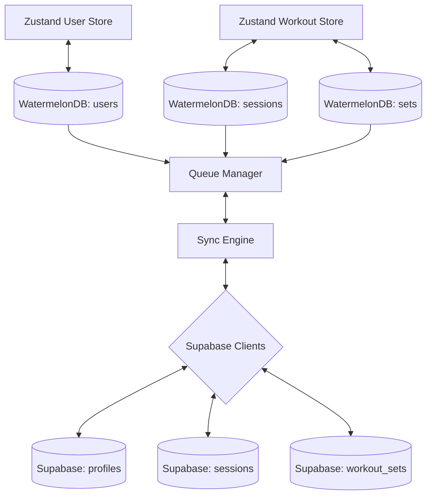

# HeuristicAI — Sync Layer Architecture & Flow

This document details the bi-directional, offline-first sync layer architecture designed for HeuristicAI. It coordinates data sync between a local WatermelonDB instance and a cloud Supabase database, gated under Firebase Authentication.

---

## 1. System Overview



---

## 2. Local database schema (WatermelonDB)

The local SQLite/LokiJS database uses version **2** schema configured with:
- **`users`**: Stores profile information (`display_name`, `goal`, `training_level`, `equipment`, `injury_flags`, `synced_at`, `created_at`).
- **`sessions`**: Stores individual workouts (`user_id`, `started_at`, `ended_at`, `status`, `total_volume_kg`, `avg_rpe`, `synced`).
- **`sets`**: Individual exercise logs (`session_id`, `exercise_id`, `set_number`, `target_reps`, `completed_reps`, `target_weight_kg`, `actual_weight_kg`, `rpe`, `synced`).

---

## 3. Queue Management & Offline-First Strategy

1. **Queueing Updates**:
   - Every local mutation (e.g. completing onboarding, saving workout, logging sets) writes to WatermelonDB and enqueues an action (`create`, `update`, `delete`) in the background `queueManager`.
   - The queue manager persists synchronization requests locally, preventing data loss if the app is closed or network connection is dropped.

2. **Sync Scheduler**:
   - Triggers sync on app startup and whenever network connectivity status changes (monitored via `@react-native-community/netinfo`).
   - Uses periodic polling (e.g. every 30 seconds) in the background with `unref` timers to prevent Jest worker memory leaks in tests.

---

## 4. Conflict Resolution Policy

HeuristicAI implements a **Pull-before-Push** strategy to reconcile conflicts:

* **Profile Reconcile**:
  - If a profile exists in the cloud, it overrides local settings unless local changes are newer (`updated_at` comparison).
  - During guest-to-account upgrades, guest profile variables are merged and uploaded, overriding any default cloud templates.

* **Session Reconcile**:
  - **Cloud Wins**: If the cloud session timestamp is newer or status is completed, the local session is updated.
  - **Local Wins**: If local updates are newer and the session is still active, the local session is preferred.

* **Set Reconcile**:
  - Workout sets are synced deterministically using their unique UUID. A secondary set-numbering pass executes outside the main write transaction to ensure sets are numbered sequentially and consistently on all devices.

---

## 5. Security & Row Level Security (RLS)

All Supabase tables have **Row Level Security (RLS)** enabled. We verify user ownership using Firebase UIDs.
1. The custom function `auth.firebase_uid()` extracts the `sub` claim from the JWT token:
   ```sql
   CREATE OR REPLACE FUNCTION auth.firebase_uid() RETURNS text AS $$
     SELECT NULLIF(current_setting('request.jwt.claims', true)::json->>'sub', '')::text;
   $$ LANGUAGE sql STABLE;
   ```
2. Policies are applied to profiles, sessions, and sets:
   ```sql
   CREATE POLICY "users_own_sessions" ON public.sessions 
     FOR ALL USING (auth.firebase_uid() = firebase_uid);
   ```

---

## 6. Optimization & Indexing

To support fast delta synchronization and prevent scan timeouts on high-frequency tables, the following indexes are applied:
- `idx_sessions_firebase_uid` on `public.sessions(firebase_uid)`
- `idx_workout_sets_session_id` on `public.workout_sets(session_id)`
- `idx_workout_sets_firebase_uid` on `public.workout_sets(firebase_uid)`
- `idx_heuristic_metrics_firebase_uid` on `public.heuristic_metrics(firebase_uid)`
